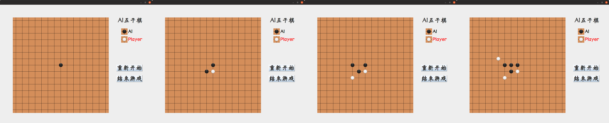
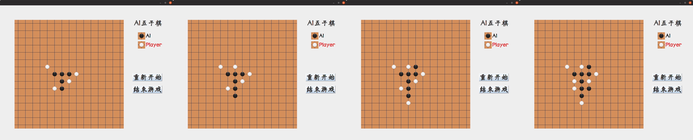
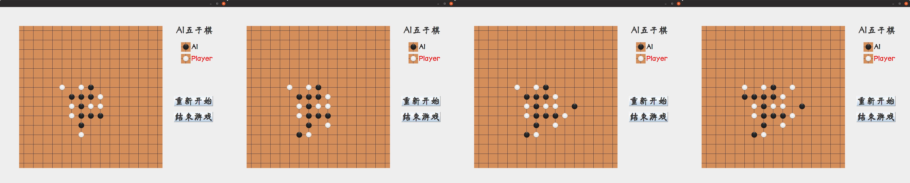
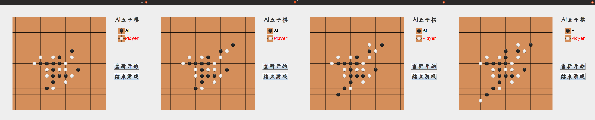
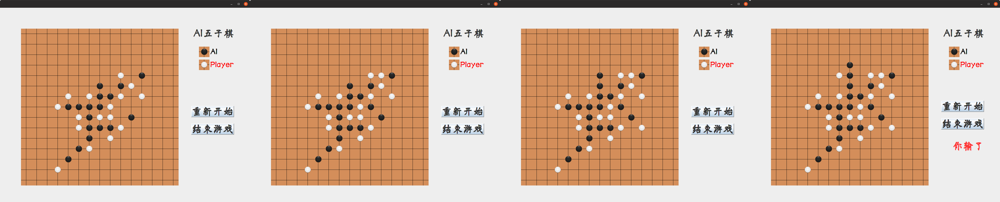

# 人工智能基础 实验一 实验报告

>   姓名：张劲暾
>
>   学号：PB16111485
>
>   实验环境：
>
>   ​    操作系统：Ubuntu 19.04
>
>   ​    CPU：Intel® Core™ i7-6500U CPU @ 2.50GHz × 4
>
>   ​    编译器：g++ (Ubuntu 8.3.0-6ubuntu1) 8.3.0, openjdk version "1.8.0_212"
>
>   ​    并行库：OPENMP 201511

[TOC]

## $A^*$搜索问题

### 实验要求

迷宫大小设置为 18\*25,所以输入为大小为 18*25 二维数组 A\[18][25],数组的下标代表点的位置,数组的值代表该位置是否可通行,0 表示可通行,1 表示不可通行。本实验中入口和出口的位置设为(1,0) 和(16,24);需要的迷宫矩阵 `input.txt` 已经给出。

输出时将花费的时间(以 s 为单位),动作序列,总步数输出到文件。字母大写, 字母之间无空格。U 代表 up,即上移,D 代表 down,即下移,L 代表 left,即左移,R 代表 right,即右移。输出的动作序列应为从初始状态(入口)开始,到目标状态(出口)结束时,中间经过的所有的空格的操作动作。

使 用 C/C++ 实 现 $A^*$ 和 $IDA^*$ 的 2 个 算 法 , 对 应 输 出 文 件 为`output_A.txt`, `output_IDA.txt`.

### 实验设计

#### $A^*$搜索格点数据结构设计

```c++
struct grid
{
    int obstacle;       // 记录节点是否可以通行
    int x;
    int y;              // 记录节点坐标，方便优先队列使用
    int f;
    int g;              // 已知最小g值，初始化为无穷大
    int h;              // 启发函数值，可以在一开始就计算得到
    int enterDirection; // 记录上一个节点是按哪个方向移动进入当前节点，用于最后输出最优路径
    //-------------------------------------------------------
    // 优先队列优先级比较算符定义
    friend bool operator <(const grid &a, const grid &b)
    {
        return a.f > b.f;
    }
};
typedef struct grid grid;
```

#### $A^*$搜索算法设计

```pseudocode
AStarSearch
    计算每个节点的启发函数值h
    定义优先队列 expandCandidate
    将出发节点g值定义为0，然后插入优先队列
    while(true)
    {
        将expandCandidate首节点弹出为searchingGrid
        如果searchingGrid是终点
             break
        依次对上下左右四个方向的邻居节点判断：
            1. 可以通行
            2. 走过去比之前探索的路径更优，即nextGrid.g > newg
        如果满足以上两个条件，则
            更新相应节点的g，f，enterDirection值
            将相应节点插入优先队列
    }
    从终点开始恢复最优路径
```

#### $A^*$搜索算法实现

```c++
#define UP      0
#define DOWN    1
#define LEFT    2
#define RIGHT   3
char direction[4] = {'U','D','L','R'};
std::vector<char> AStarSearch(grid** graph, int height, int width, int beginX, int beginY, int endX, int endY)
{
    graph[beginX][beginY].g = 0;
    for(int i = 1; i <= height; i++)
    {
        for(int j = 1; j <= width; j++)
        {
            graph[i][j].h = abs(i - endX) + abs(j - endY);
        }
    }
    graph[beginX][beginY].f = graph[beginX][beginY].g + graph[beginX][beginY].h;
//--------------------------------------------------------------------------------------------------------------
    std::priority_queue<grid> expandCandidate;
    expandCandidate.push(graph[beginX][beginY]);

    while(true){
        grid searchingGrid = expandCandidate.top();
        expandCandidate.pop();
        //-------------------------------------------------
        #ifdef DEBUG
            printf("Searching [%d,%d] from %c\n",searchingGrid.x,searchingGrid.y,direction[searchingGrid.enterDirection]);
        #endif
        //-------------------------------------------------
        if(searchingGrid.x == endX && searchingGrid.y == endY)
        {
            //-------------------------------------------------
            #ifdef DEBUG
                printf("Found\n");
            #endif
            //-------------------------------------------------
            break;
        }
        int newg = graph[searchingGrid.x][searchingGrid.y].g + 1;
        // Up
        if( graph[searchingGrid.x - 1][searchingGrid.y].obstacle == 0 && graph[searchingGrid.x - 1][searchingGrid.y].g > newg )
        {
            graph[searchingGrid.x - 1][searchingGrid.y].g = newg;
            graph[searchingGrid.x - 1][searchingGrid.y].f = newg + graph[searchingGrid.x - 1][searchingGrid.y].h;
            graph[searchingGrid.x - 1][searchingGrid.y].enterDirection = UP;
            expandCandidate.push(graph[searchingGrid.x - 1][searchingGrid.y]);
        }
        // Left
        if( graph[searchingGrid.x][searchingGrid.y - 1].obstacle == 0 && graph[searchingGrid.x][searchingGrid.y - 1].g > newg )
        {
            graph[searchingGrid.x][searchingGrid.y - 1].g = newg;
            graph[searchingGrid.x][searchingGrid.y - 1].f = newg + graph[searchingGrid.x][searchingGrid.y - 1].h;
            graph[searchingGrid.x][searchingGrid.y - 1].enterDirection = LEFT;
            expandCandidate.push(graph[searchingGrid.x][searchingGrid.y - 1]);
        }
        // Right
        if( graph[searchingGrid.x][searchingGrid.y + 1].obstacle == 0 && graph[searchingGrid.x][searchingGrid.y + 1].g > newg )
        {
            graph[searchingGrid.x][searchingGrid.y + 1].g = newg;
            graph[searchingGrid.x][searchingGrid.y + 1].f = newg + graph[searchingGrid.x][searchingGrid.y + 1].h;
            graph[searchingGrid.x][searchingGrid.y + 1].enterDirection = RIGHT;
            expandCandidate.push(graph[searchingGrid.x][searchingGrid.y + 1]);
        }
        // Down
        if( graph[searchingGrid.x + 1][searchingGrid.y].obstacle == 0 && graph[searchingGrid.x + 1][searchingGrid.y].g > newg )
        {
            graph[searchingGrid.x + 1][searchingGrid.y].g = newg;
            graph[searchingGrid.x + 1][searchingGrid.y].f = newg + graph[searchingGrid.x + 1][searchingGrid.y].h;
            graph[searchingGrid.x + 1][searchingGrid.y].enterDirection = DOWN;
            expandCandidate.push(graph[searchingGrid.x + 1][searchingGrid.y]);
        }
    }
//--------------------------------------------------------------------------------------------------------------
    std::vector<char> resultPath;
    int tempX = endX, tempY = endY;
    while( !( tempX == beginX && tempY == beginY ) )
    {
        //-------------------------------------------------
        #ifdef DEBUG
            printf("Back going [%d,%d] to [%d,%d]\n",tempX,tempY,beginX,beginY);
            getchar();
        #endif
        //-------------------------------------------------
        resultPath.push_back( direction[ graph[tempX][tempY].enterDirection ] );
        switch (graph[tempX][tempY].enterDirection)
        {
            case UP:    tempX += 1; break;
            case DOWN:  tempX -= 1; break;
            case LEFT:  tempY += 1; break;
            case RIGHT: tempY -= 1; break;
        }
    }
    for(int i = 0; i < height + 2; i++)
    {
        free(graph[i]);
    }
    free(graph);
    return resultPath;
}
```

#### $IDA^*$搜索格点数据结构设计

```c++
struct grid
{
    int obstacle;       // 记录节点是否可以通行
    int h;              // 启发函数值，可以在一开始就计算得到
    int g;              // 已知最小g值，初始化为无穷大
    int enterDirection; // 记录上一个节点是按哪个方向移动进入当前节点，用于最后输出最优路径
    int inPath;         // DFS标记位，表示该节点是否已在搜索路径中
};
typedef struct grid grid;
```

#### $IDA^*$搜索算法设计

```pseudocode
iterativeDeepeningSearch: // 限制深度(f值)的DFS，如果找到终点就返回找到信号，否则返回超过深度(f值)限制的最小深度(f值)
		计算当前节点深度并判断是否超过限制，如果超过就返回当前深度
		判断是否已经到达终点，如果是就返回找到终点信号
		min = 正无穷大	// 如果邻居节点都无法在限制内到达终点，则返回四点中超过深度(f值)限制的最小深度(f值)
		依次对上下左右四个方向的邻居节点判断：
            1. 可以通行
            2. 走过去比之前探索的路径更优，即nextGrid.g > newg
            3. 不在已搜索路径中
 		如果满足以上三个条件，则
            更新相应节点的g，enterDirection值
            将相应节点加入路径
            f = iterativeDeepeningSearch from 相应节点
            if(f 是 找到终点信号)
                return f
            min > f ? min = f : 0;
            将相应节点弹出路径
    return min
  	 
IDAStarSearch:
    计算每个节点的启发函数值h
    将出发节点加入DFS路径
    while(true)
    {
    		temp = iterativeDeepeningSearch from 出发点
    		if(temp 是 找到终点信号)
        		break
    		将temp设为新的bound
    }
    从终点开始恢复最优路径
```

#### $IDA^*$搜索算法实现

```c++
#define GET     -1
#define UP      0
#define DOWN    1
#define LEFT    2
#define RIGHT   3
char direction[4] = {'U','D','L','R'};
int iterativeDeepeningSearch(grid** graph, int curX, int curY, int g, int bound, int endX, int endY)
{
    #ifdef DEBUG
        for(int i = 0; i < 30 + 2; i++)
        {
            for(int j = 0; j < 60 + 2; j++)
            {
                if(graph[i][j].obstacle){printf(".. ");}
                else printf("%2.d ",graph[i][j].g % 200);
            }
            printf("\n");
        }
        getchar();
    #endif
    int f = g + graph[curX][curY].h;
    if(f > bound)
    {
        #ifdef DEBUG
            printf("EXCEEDING %d\n",f);
        #endif
        return f;
    }
    if(curX == endX && curY == endY)
    {
        return GET;
    }
    int min = __INT_MAX__;

    if( graph[curX][curY + 1].obstacle == 0 && 
        graph[curX][curY + 1].inPath == 0   &&
        graph[curX][curY + 1].g > g + 1
        )
    {
        graph[curX][curY + 1].g = g + 1;
        graph[curX][curY + 1].inPath = 1;
        graph[curX][curY + 1].enterDirection = RIGHT;
        f = iterativeDeepeningSearch(graph, curX, curY + 1, g + 1, bound, endX, endY);
        if(f == GET)
        {
            return GET;
        }
        min > f ? min = f : 0;
        graph[curX][curY + 1].inPath = 0;
    }
    if( graph[curX + 1][curY].obstacle == 0 && 
        graph[curX + 1][curY].inPath == 0   &&
        graph[curX + 1][curY].g > g + 1
        )
    {
        graph[curX + 1][curY].g = g + 1;
        graph[curX + 1][curY].inPath = 1;
        graph[curX + 1][curY].enterDirection = DOWN;
        f = iterativeDeepeningSearch(graph, curX + 1, curY, g + 1, bound, endX, endY);
        if(f == GET)
        {
            return GET;
        }
        min > f ? min = f : 0;
        graph[curX + 1][curY].inPath = 0;
    }
    if( graph[curX - 1][curY].obstacle == 0 && 
        graph[curX - 1][curY].inPath == 0   &&
        graph[curX - 1][curY].g > g + 1
        )
    {
        graph[curX - 1][curY].g = g + 1;
        graph[curX - 1][curY].inPath = 1;
        graph[curX - 1][curY].enterDirection = UP;
        f = iterativeDeepeningSearch(graph, curX - 1, curY, g + 1, bound, endX, endY);
        if(f == GET)
        {
            return GET;
        }
        min > f ? min = f : 0;
        graph[curX - 1][curY].inPath = 0;
    }
    if( graph[curX][curY - 1].obstacle == 0 && 
        graph[curX][curY - 1].inPath == 0   &&
        graph[curX][curY - 1].g > g + 1
        )
    {
        graph[curX][curY - 1].g = g + 1;
        graph[curX][curY - 1].inPath = 1;
        graph[curX][curY - 1].enterDirection = LEFT;
        f = iterativeDeepeningSearch(graph, curX, curY - 1, g + 1, bound, endX, endY);
        if(f == GET)
        {
            return GET;
        }
        min > f ? min = f : 0;
        graph[curX][curY - 1].inPath = 0;
    }
    return min;
}
std::vector<char> IDAStarSearch(grid** graph, int height, int width, int beginX, int beginY, int endX, int endY)
{
    for(int i = 1; i <= height; i++)
    {
        for(int j = 1; j <= width; j++)
        {
            graph[i][j].h = abs(i - endX) + abs(j - endY);
        }
    }
//--------------------------------------------------------------------------------------------------------------
    int bound = graph[beginX][beginY].h;
    graph[beginX][beginY].inPath = 1;
    graph[beginX][beginY].g = 0;
    while(true){
        int temp = iterativeDeepeningSearch(graph, beginX, beginY, 0, bound, endX, endY);
        if(temp == GET)
        {
            break;
        }
        //-------------------------------------------------
        #ifdef DEBUG 
            printf("old bound %d, new bound %d\n",bound, temp);
        #endif
        //-------------------------------------------------
        bound = temp;
        for(int i = 1; i <= height; i++)
        {
            for(int j = 1; j <= width; j++)
            {
                graph[i][j].g = __INT_MAX__;
            }
        }
    }
//--------------------------------------------------------------------------------------------------------------
    std::vector<char> resultPath;
    int tempX = endX, tempY = endY;
    while( !( tempX == beginX && tempY == beginY ) )
    {
        //-------------------------------------------------
        #ifdef DEBUG
            printf("Back going [%d,%d] to [%d,%d]\n",tempX,tempY,beginX,beginY);
            getchar();
        #endif
        //-------------------------------------------------
        resultPath.push_back( direction[ graph[tempX][tempY].enterDirection ] );
        switch (graph[tempX][tempY].enterDirection)
        {
            case UP:    tempX += 1; break;
            case DOWN:  tempX -= 1; break;
            case LEFT:  tempY += 1; break;
            case RIGHT: tempY -= 1; break;
        }
    }
    for(int i = 0; i < height + 2; i++)
    {
        free(graph[i]);
    }
    free(graph);
    return resultPath;
}
```


### 实验结果

#### **编译指令**

```bash
# 将 AStarSearch.cpp 中相应宏定义改为：
# ```c++
# 		#define GRID_HEIGHT 30  //18
# 		#define GRID_WIDTH  60  //25 
# 		#define BEGIN_X     1 + 1
# 		#define BEGIN_Y     0 + 1
# 		#define END_X       28 + 1  //16 + 1
# 		#define END_Y       59 + 1  //24 + 1
# ```
$ g++ AStarSearch.cpp -o AStarSearch -O3
$ ./AStarSearch ./input2.txt
# 将 AStarSearch.cpp 中相应宏定义改为：
# ```c++
#     #define GRID_HEIGHT /*30*/  18
#     #define GRID_WIDTH  /*60*/  25 
#     #define BEGIN_X     1 + 1
#     #define BEGIN_Y     0 + 1
#     #define END_X       /*28 + 1*/  16 + 1
#     #define END_Y       /*59 + 1*/  24 + 1
# ```
$ g++ AStarSearch.cpp -o AStarSearch -O3
$ ./AStarSearch ./input.txt
# 将 IDAStarSearch.cpp 中相应宏定义改为：
# ```c++
# 		#define GRID_HEIGHT 30  //18
# 		#define GRID_WIDTH  60  //25 
# 		#define BEGIN_X     1 + 1
# 		#define BEGIN_Y     0 + 1
# 		#define END_X       28 + 1  //16 + 1
# 		#define END_Y       59 + 1  //24 + 1
# ```
$ g++ IDAStarSearch.cpp -o IDAStarSearch -O3
$ ./IDAStarSearch ./input2.txt
# 将 IDAStarSearch.cpp 中相应宏定义改为：
# ```c++
#     #define GRID_HEIGHT /*30*/  18
#     #define GRID_WIDTH  /*60*/  25 
#     #define BEGIN_X     1 + 1
#     #define BEGIN_Y     0 + 1
#     #define END_X       /*28 + 1*/  16 + 1
#     #define END_Y       /*59 + 1*/  24 + 1
# ```
$ g++ IDAStarSearch.cpp -o IDAStarSearch -O3
$ ./IDAStarSearch ./input.txt
```

#### 样例结果

| 样例文件     |  搜索算法| 步数 | 用时(s) |
|:----:| :--: | :--: |:----:|
| `input.txt` | $A^*$ | 39 | 0.000012 |
| `input.txt` | $IDA^*$ | 39 | 0.000005 |
| `input2.txt` | $A^*$ | 116 | 0.000128 |
| `input2.txt` | $IDA^*$ | 116 | 0.000867 |

### 分析与讨论

#### 启发函数选择

本实验中选择曼哈顿距离作为启发函数，因为在迷宫中从一个点到另一个点的最短距离(路径长度)不可能小于曼哈顿距离(即便中间没有任何障碍也最多是等于曼哈顿距离)，所以选择曼哈顿距离作为启发函数是可采纳而且形式简单的。

#### $A^*$搜索算法复杂度分析

**(n为迷宫大小：行 X 高)**

时间复杂度：一个格点g值的改变可能导致3个格点再次进入队列，时间复杂度O($3^n$ * lgn)

空间复杂度：优先队列O(n)，`grid`二维数组O(n)，最优路径向量O(n)，总的空间复杂度O(n)

#### $IDA^*$搜索算法复杂度分析

时间复杂度：最多迭代O(n)轮，深度搜索每一步最多三个孩子，时间复杂度 O($\sum^{n}_{k = 1} 3^k$) = O($3^n$)

空间复杂度：grid二维数组O(n)，最优路径向量O(n)，总的空间复杂度O(n)

#### 降低计算复杂度的设计

1.  记录H值，H值不用重复计算
2.  $IDA^*$记录g值进行深搜剪枝
3.  `grid`二维数组加边框，避免边界判断
4.  `enterDirection`状态维护，避免维护最优搜索路径(维护最优搜索路径对$A^*$不方便，对$IDA^*$不符合局部性原理)

## 五子棋人机对弈

### 实验要求

围棋棋盘使用国际比赛标准,为十五路(15×15)棋盘,形状近于正方形,平面上画横竖各15条平行线,线路为黑色,构成 225 个交叉点。

1.  设计一个评分函数对棋盘上局面进行评分。请在实验报告中展示你的评分规则并给出理由。
2.  利用你设计好的评分函数生成一颗博弈树。使用 minimax 算法和$\alpha\beta$剪枝策略实现一个固定搜索深度(搜索深度大于 1)的人机对弈的五子棋 AI。
3.  结果的呈现为你和你的 AI 棋手对弈一局的过程。
4.  思考题:
    1.  思考搜索的深度对 AI 的决策效率有何影响?如何利用搜索深度提高 AI 的智能程度?
    2.  $\alpha\beta$剪枝法在减枝过程搜索效率与节点的排列顺序有很大关系。思考是否可以改进剪枝策略提高决策速度?
    3.  思考是否有方法实现 AI 的自学习能力,让 AI 不在相同的地方犯错?本题只需要给出思路,不需要具体实现。

### 实验设计

#### 带$\alpha\beta$剪枝的minmax博弈树算法设计

```pseudocode
AlphaBetaMINIMAX with depth from 一个player alpha beta
    判断深度是否为零(达到叶子节点)或者是否有一方已经获胜(有长连)， 如果是， 返回棋局评估值
    计算棋盘上可行节点的优先级并依次压入优先队列expandCandidate
    if( MAX方 )
        while( expandCandidate 非空)
            将expandCandidate首节点弹出为searchingGrid
            在searchingGrid对应节点落子
            score = AlphaBetaMINIMAX with depth - 1 from 另一个player  alpha beta
            if(score > alpha)
                alpha = score;
                记录这个当前最优点的位置
            searchingGrid对应节点清空
            if(alpha >= beta)    // 剪枝，其父必不选
                return alpha;
    else
        while( expandCandidate 非空)
            将expandCandidate首节点弹出为searchingGrid
            在searchingGrid对应节点落子
            score = AlphaBetaMINIMAX with depth - 1 from 另一个player  alpha beta
            if(score < beta)
                beta = score;
                记录这个当前最优点的位置
            searchingGrid对应节点清空
            if(alpha >= beta)    // 剪枝，其父必不选
                return beta;
```

#### 带$\alpha\beta$剪枝的minmax博弈树算法实现

```c++
int AlphaBetaMINIMAX(int** board, int depth, int player, int alpha, int beta, step& next)
{
    if( depth == 0 || gameover(board) != 0 )
    {
        return evaluate(board, player);
    }
//====================================================================================================
    order pri[15][15];
    std::priority_queue<order> expandCandidate;
    for(int i = 0; i < 15; i++)
    {
        for(int j = 0; j < 15; j++)
        {
            if(board[i][j] == 0)
            {
                pri[i][j].x = i;
                pri[i][j].y = j;
                pri[i][j].priority =  startup[i][j];
        i > 1 ? pri[i][j].priority += board[i - 1][j    ] == MAX : 0;
        i <14 ? pri[i][j].priority += board[i + 1][j    ] == MAX : 0;
        j > 1 ? pri[i][j].priority += board[i    ][j - 1] == MAX : 0;
        j <14 ? pri[i][j].priority += board[i    ][j + 1] == MAX : 0;
 i > 1&&j > 1 ? pri[i][j].priority += board[i - 1][j - 1] == MAX : 0;
 i > 1&&j <14 ? pri[i][j].priority += board[i - 1][j + 1] == MAX : 0;
 i <14&&j > 1 ? pri[i][j].priority += board[i + 1][j - 1] == MAX : 0;
 i <14&&j <14 ? pri[i][j].priority += board[i + 1][j + 1] == MAX : 0;
                expandCandidate.push( pri[i][j] );
            }
        }
    }
//===================================== MAX ==========================================================
    if(player == MAX)
    {
        while(!expandCandidate.empty())
        {
            order searchingGrid = expandCandidate.top();
            expandCandidate.pop();
            board[searchingGrid.x][searchingGrid.y] = 1;
            int score = AlphaBetaMINIMAX(board, depth - 1, player^1, alpha, beta, next);
            board[searchingGrid.x][searchingGrid.y] = 0;
            if(score > alpha)
            {
                alpha = score;
                if(depth == DEPTH)
                {
                    next.x = searchingGrid.x;
                    next.y = searchingGrid.y;
                }
            }
            if(alpha >= beta)    // 剪枝，其父必不选
            {
                return alpha;
            }
        }
        return alpha;
    }
//===================================== MIN ==========================================================
    else
    {
        while(!expandCandidate.empty())
        {
            order searchingGrid = expandCandidate.top();
            expandCandidate.pop();
            board[searchingGrid.x][searchingGrid.y] = -1;
            int score = AlphaBetaMINIMAX(board, depth - 1, player^1, alpha, beta, next);
            board[searchingGrid.x][searchingGrid.y] = 0;
            if(score < beta)
            {
                beta = score;
                if(depth == DEPTH)
                {
                    next.x = searchingGrid.x;
                    next.y = searchingGrid.y;
                }
            }
            if(alpha >= beta)    // 剪枝，其父必不选
            {
                return beta;
            }
        }
        return beta;
    }
//======================================================================================================
}
```

<span id="evaluate"></span>

#### **棋局评估函数设计** 

棋局评估基本思路：计算双方的优势值，用MAX方优势值减去MIN方优势值就是当前棋局的评估值，这样当MAX方越占优势时，棋局评估值就越大；当MIN方越占优势时，棋局评估值就越小。计算优势值从下面几个方面考虑：

*   棋型分析

扫描棋盘，统计双方的有利棋型，对每种棋型赋一个价值，存在一个棋型实例就把相应的棋型价值加入对应方的优势值。

| 棋型名称 |                           棋型描述                           | 检测函数(详见`evaluate.h`) |   价值    |
| :------: | :----------------------------------------------------------: | :------------------------: | :-------: |
|  *长连*  |                           *11111*                            |        **gameover**        | 100000000 |
|  *活四*  |                           *011110*                           |      **PerfectFour**       | 40000000  |
|  *冲四*  | *011112* <br> 或 *10111* <br>或 *11011*<br>或 *11101*<br>或 *2111110* |       **ThreatFour**       |  1000000  |
|  *活三*  |       *01110* <br/> 或 *010110* <br/>或 *011010*<br/>        |      **ThreatThree**       |  500000   |
|  *眠三*  | *001112* <br/> 或 *211100* <br/>或 *010112*<br/>或 *011012*<br/>或 *10011* <br/>或 *11001* <br/>或 *10101* <br/>   或 *2011102* |        **TryThree**        |   10000   |
|  *活二*  |   *00110* <br/> 或 *01100* <br/>或 *01010*<br/>或 *010010*   |        **GoodTwo**         |    500    |
|  *眠二*  | *000112*  <br/> 或 *211000*  <br/>或 *010012* <br/>或 *10001*  <br/>或 *2010102*<br/>或 *2011002* |       **LimitedTwo**       |    10     |

*   配合奖励

    我们希望看到“双活三”，“眠四带活三”，“双眠四”这样的绝杀棋型，为了鼓励在某一步能产生更多有利棋型的选择，我们把同种棋型数平方后再乘价值。

*   启动势能

    越是靠近中心的棋子越有潜力，所以我们给每个位置赋一个启动势能，在初始有利棋型不多时加快有效决策。

    ```c++
    int startup[15][15] = 
    {
        0, 0, 0, 0, 0, 0, 0, 0, 0, 0, 0, 0, 0, 0, 0,
        0, 1, 1, 1, 1, 1, 1, 1, 1, 1, 1, 1, 1, 1, 0,
        0, 1, 2, 2, 2, 2, 2, 2, 2, 2, 2, 2, 2, 1, 0,
        0, 1, 2, 3, 3, 3, 3, 3, 3, 3, 3, 3, 2, 1, 0,
        0, 1, 2, 3, 4, 4, 4, 4, 4, 4, 4, 3, 2, 1, 0,
        0, 1, 2, 3, 4, 5, 5, 5, 5, 5, 4, 3, 2, 1, 0,
        0, 1, 2, 3, 4, 5, 6, 6, 6, 5, 4, 3, 2, 1, 0,
        0, 1, 2, 3, 4, 5, 6, 7, 6, 5, 4, 3, 2, 1, 0,
        0, 1, 2, 3, 4, 5, 6, 6, 6, 5, 4, 3, 2, 1, 0,
        0, 1, 2, 3, 4, 5, 5, 5, 5, 5, 4, 3, 2, 1, 0,
        0, 1, 2, 3, 4, 4, 4, 4, 4, 4, 4, 3, 2, 1, 0,
        0, 1, 2, 3, 3, 3, 3, 3, 3, 3, 3, 3, 2, 1, 0,
        0, 1, 2, 2, 2, 2, 2, 2, 2, 2, 2, 2, 2, 1, 0,
        0, 1, 1, 1, 1, 1, 1, 1, 1, 1, 1, 1, 1, 1, 0,
        0, 0, 0, 0, 0, 0, 0, 0, 0, 0, 0, 0, 0, 0, 0
    };
    ```

*   先手优势

    根据“先手优势无限大”的理论，我们对于先手方的优势值加倍，鼓励程序在自己先手时采取更加激进的进攻策略，在后手时采取更加保守的防御策略。

#### 棋局评估函数实现

```c++
#include "evaluate.h"
int evaluate(int** board, int player)
{
    //return 0;
    int max_benefit = 0;    // HUMAN 当前的优势
    int min_benefit = 0;    // AGENT 当前的优势

    // 棋型：长连 11111
    switch( gameover(board) )
    {
        case -1: min_benefit += 100000000; return max_benefit - min_benefit;
        case  1: max_benefit += 100000000; return max_benefit - min_benefit;
    }

    typeCount tempTC;

    omp_set_num_threads(6); // 设置线程数量
    int penalty[6] = {40000000, 1000000, 500000, 10000, 500, 10};
    //=============================================================================================
    #pragma omp parallel private(tempTC)
    {
        int id = omp_get_thread_num();
        switch( id )
        {
            case 0: tempTC = PerfectFour(board);    break;
            case 1: tempTC = ThreatFour(board);     break;
            case 2: tempTC = ThreatThree(board);    break;
            case 3: tempTC = TryThree(board);       break;
            case 4: tempTC = GoodTwo(board);        break;
            case 5: tempTC = LimitedTwo(board);     break;
        }
        #pragma omp critical
        {
            min_benefit += tempTC.minC * tempTC.minC * penalty[id];
            max_benefit += tempTC.maxC * tempTC.maxC * penalty[id];
        }
    }
    //=============================================================================================
    for(int i = 0; i < 15; i++)
    {
        for(int j = 0; j < 15; j++)
        {
            if(board[i][j] ==  1)   max_benefit += startup[i][j];
            if(board[i][j] == -1)   min_benefit += startup[i][j];
        }
    }
    player == MAX ? max_benefit *= 2 : min_benefit *= 2;
    return max_benefit - min_benefit;
}
```

### 实验结果

#### **编译指令**

```bash
# 命令行界面
# 在 AlphaBetaGame.cpp 中修改：
# // #define GRAPH
$ g++ AlphaBetaGame.cpp -fopenmp -o AlphaBetaGame
$ ./AlphaBetaGame
# 图形界面
# 在 AlphaBetaGame.cpp 中修改：
# #define GRAPH
$ g++ AlphaBetaGame.cpp -fopenmp -o AlphaBetaGame
$ cd why_GUI                                     
$ java gomokugui.GomokuGUI  
```

#### 对弈过程（搜索深度：3）

**声明：图形化界面程序使用王浩宇同学代码，非原创**

**声明：图形化界面程序使用王浩宇同学代码，非原创**

**声明：图形化界面程序使用王浩宇同学代码，非原创**







### 分析与讨论

1.  思考搜索的深度对 AI 的决策效率有何影响?如何利用搜索深度提高 AI 的智能程度?

    决策用时是搜索深度的指数函数，搜索深度越深，对于棋局的发展就有着更长远的预见，所做决策就更加智能，相应的需要的决策时间就会增加，决策效率就会下降，

    **但根据实际表现发现上面的理论依据严重依赖于棋局评估函数的质量(评估准确性)，因为博弈树的基本假设是“双方最优决策”，这就有一个问题：程序对于对方的判断是根据自己的水平(棋局评估函数的质量)判断的，如果棋局评估函数的质量比较差，就好像一个臭棋篓子帮着另一个臭棋篓子下棋，结果预测的最优路线会与实际最优路线偏差越来越大，当depth达到5或6时，在面对一些人类对手的长远策略时，表现甚至不如depth为2或3的时候，再做一个比喻就是，如果完美的评价是1，人类高手的评价水平是0.9，棋局评估函数的质量是0.8，那么depth=2时，人类对程序就是0.9：0.8，还看不出太大差别，depth=6时，就会是0.729：0.512。**

    **当棋局评估函数的质量不高的时候，加深搜索并没有带来与相应决策代价对等的智能程度**

2.  $\alpha\beta$剪枝法在减枝过程搜索效率与节点的排列顺序有很大关系。思考是否可以改进剪枝策略提高决策速度?

    在这里解释前文中提到的“可行节点优先级”概念，基本思想是：

    1.  优先考虑靠近中心，潜力大的子节点
    2.  对于MAX方来说，应该优先考虑靠近已有黑棋进攻，对于MIN方来说，应该优先考虑靠近已有黑棋防守

    综上，定义 **优先级** := 对应的`startup`值 + 周围8个位置中黑棋个数

    利用优先级建立优先队列，得到高效的子节点检查顺序

    结果表明这一顺序可以明显提高决策效率

3.  思考是否有方法实现 AI 的自学习能力,让 AI 不在相同的地方犯错?本题只需要给出思路,不需要具体实现。
    1.  用0~224的整数序列表示下棋过程，并记录序列对应的结局的棋局评估值
    2.  每一步去匹配历史上相同开头序列的比赛串，用剩余未匹配长度和最终棋局估计值计算一个“未来期望”加入到棋局估计函数的决策中，类似于“历史启发函数”
    
4.  你设计的评分函数和理由。

    详见[**棋局评估函数设计**](#evaluate)

5.  算法思想,分析 $\alpha\beta$ 剪枝法在本实验中的作用。

    minmax博弈树：MAX方尽量选取可以得到更大评价值的子节点，MIN方尽量选择可以得到更小评价值的子节点

    $\alpha\beta$ 剪枝法：父节点已经有一个不错的底线了，结果某个子节点可以让父节点得到比这个底线差的结果，父节点必然不会选择他，更本就没有必要展开，在这个问题中可以明显提高搜索效率，避免展开一些很差或者很远的节点

6.  实验结果说明,分析你的 AI 棋手的棋力大小,在和 AI 对弈的过程中你的棋力是否提高

    报告中只有一场结果，多次体验可能有如下结果：

    1.  AI棋手会谋划“双活三”，“眠四带活三”，“双眠四”棋型算计你
    2.  因为防止溢出，在长连判断时偶然会出现选择更多绝杀点而不是当场绝杀的问题，就是当他必胜的时候他会故意虐你一会
    3.  可以截杀你潜在的“双活三”，“眠四带活三”，“双眠四”
    4.  可以利用多个眠四点击杀“双活三”
    5.  初始3-4步基本表现和人类差不多
    6.  由于采取了先手加倍，鼓励激进进攻和保守防御，有时会出现你被压住打或者白棋防守方被黑棋进攻方防死的情况
    7.  可以组织“梅花阵”
    8.  可以看见一些远离当前“焦点”的优秀决策位置
    9.  被绝杀时会根据情况象征性挣扎或者当场把棋子丢到角落
    10.  depth = 3时，体验良好，depth > 3 延迟很大
