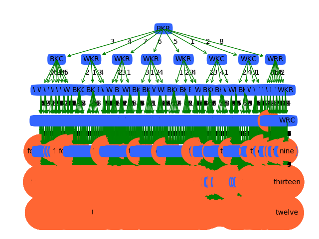
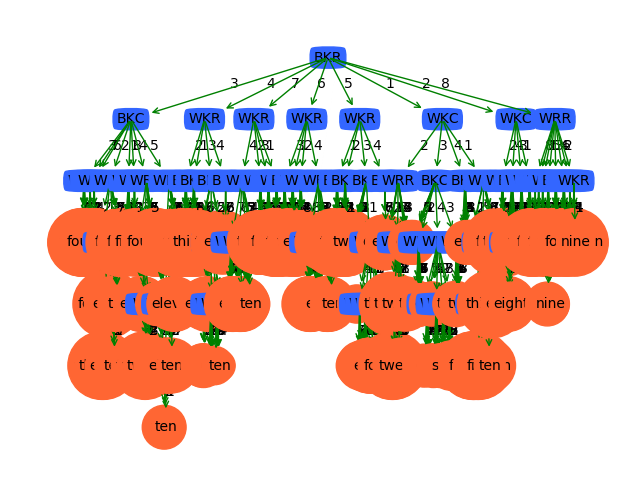

# 人工智能基础编程作业2 —— 国际象棋 Checkmate 预测

>   姓名：张劲暾
>
>   学号：PB16111485

---

## 目录

[TOC]

---

## K近邻

### 原始六个特征K近邻结果

| K    | Accuracy               | Macro_F1               | Micro_F1               |
| :--- | ---------------------- | ---------------------- | ---------------------- |
| 1    | 0.5166739445197767     | 0.4825912152571868     | 0.532271696098928      |
| 2    | 0.5166739445197767     | 0.4825912152571868     | 0.532271696098928      |
| 3    | 0.5770129103462437     | 0.581237828743619      | 0.6334682620879855     |
| 4    | 0.6257410860912406     | 0.6540083894372599     | 0.7009474667496998     |
| 5    | 0.6631759048939496     | 0.6981780269374958     | 0.7460522218762512     |
| 6    | 0.6908515411327248     | 0.7245641871519749     | 0.7762555046483697     |
| 7    | 0.7076840746686813     | **0.7319563508661349** | 0.7934700413682665     |
| 8    | **0.7102328373297949** | 0.7289661911479546     | **0.7960055157688715** |
| 9    | 0.6992317501788435     | 0.7121129711445539     | 0.7849294960188604     |

### 增加人工处理特征

根据国际象棋规则，加入白皇白车行差，白皇白车列差，白皇黑皇行差，白皇黑皇列差，黑皇白车行差，黑皇白车列差，黑皇白车曼哈顿距离7个特征

| K    | Accuracy               | Macro_F1               | Micro_F1               |
| :--- | ---------------------- | ---------------------- | ---------------------- |
| 1    | 0.4401566324033284     | 0.3075965795721245     | 0.3640407455184378     |
| 2    | 0.4401566324033284     | 0.3075965795721245     | 0.3640407455184378     |
| 3    | 0.45809475292919       | 0.3515211305446855     | 0.40852275254659487    |
| 4    | 0.48191815473000493    | 0.42720581109097844    | 0.4624794270717495     |
| 5    | 0.5077353930934797     | 0.4916491201196514     | 0.5152350874071439     |
| 6    | 0.5344602144402444     | 0.5411208617776218     | 0.5644766691873138     |
| 7    | 0.5622077175081902     | 0.5822835530138714     | 0.6106489924825408     |
| 8    | 0.582575345305657      | 0.6040453374626259     | 0.6417419153952226     |
| 9    | **0.5997652269028626** | **0.6217707015240818** | **0.6663404652817935** |

效果不好，改变策略，使用原始特征，但在计算距离时使用曼哈顿距离

| K    | Accuracy              | Macro_F1               | Micro_F1               |
| ---- | --------------------- | ---------------------- | ---------------------- |
| 1    | 0.5145688846162649    | 0.49113765588639235    | 0.528312797473422      |
| 2    | 0.5145688846162649    | 0.49113765588639235    | 0.528312797473422      |
| 3    | 0.575270605696154     | 0.5837432187313495     | 0.6308438236733241     |
| 4    | 0.6248019788221562    | 0.6597124772836322     | 0.6997464525599395     |
| 5    | 0.6599442242771173    | 0.7007561053735905     | 0.742360215292914      |
| 6    | 0.6869251688208513    | 0.726098842863655      | 0.7721186779947511     |
| 7    | 0.7042699163560039    | **0.7425308815600872** | 0.7900449268270985     |
| 8    | **0.711356516786381** | 0.7420203626350129     | **0.7971175659445754** |
| 9    | 0.7081299020379879    | 0.7307470765596854     | 0.7939148614385481     |
| 10   | 0.701063398509371     | 0.7175515951088984     | 0.7867977403140429     |
| 11   | 0.6955970172344441    | 0.7125534768791278     | 0.7811930074284952     |

效果稍微好了一点，

## 决策树

### 不同划分阈值下的测试结果

|   threshold   |   Accuracy   |  Macro_F1    |   Micro_F1   |
| ---- | ---- | ---- | ---- |
|0.0     |0.6005326231691078     |0.38828709588714916     |0.4786460699681963 |
| 0.1	| 0.6005326231691078	| 0.38828709588714916	| 0.4786460699681963 |
| 0.2	| **0.6005326231691078**	| **0.38828709588714916**	| **0.4786460699681963** |
| 0.3	| 0.5873427091043671	| 0.3818813027060383	| 0.4668404942750255 |
| 0.4	| 0.5754970445996775	| 0.37612291092052796	| 0.45778781038374716|
| 0.5	| 0.5537000654878848	| 0.3720458715108832	| 0.447225606379444  |
| 0.6	| 0.5323182993392703	| 0.38259774508016153	| 0.4443494066075056 |
| 0.7	| 0.5066490954834072	| 0.3709375325080947	| 0.43944916970433373|
| 0.8	| 0.4812407680945347	| 0.33699866221808056	| 0.427757736852098  |
| 0.9	| 0.4686658286945592	| 0.33453380364743074	| 0.41612220484034235|
| 1.0	| 0.4574530763403754	| 0.3230775151244868	| 0.3992059195091139 |
| 1.1	| 0.4478330658105939	| 0.30676828144247165	| 0.38122383539681126|
| 1.2	| 0.44632499006754073	| 0.3038593126354794	| 0.3787286931818182 |
| 1.3	| 0.4444444444444444	| 0.28410325701391037	| 0.3745012855749623 |
| 1.4	| 0.44387634704633055	| 0.2783255571396552	| 0.37342781222320637|
| 1.5	| 0.4439461883408072	| 0.27855346828947536	| 0.3736049601417184 |
| 1.6	| 0.44370236505067967	| 0.2782752572305032	| 0.3731184699840623 |
| 1.7	| 0.44370236505067967	| 0.2782752572305032	| 0.3731184699840623 |
| 1.8	| 0.44370236505067967	| 0.27829636214851877	| 0.3731184699840623 |
| 1.9	| 0.44370236505067967	| 0.27829636214851877	| 0.3731184699840623 |

### 不同阈值下决策树结构的变化

threshold = 0.2

threshold = 1.2

threshold = 1.9

## 多分类SVM

## 交叉验证

