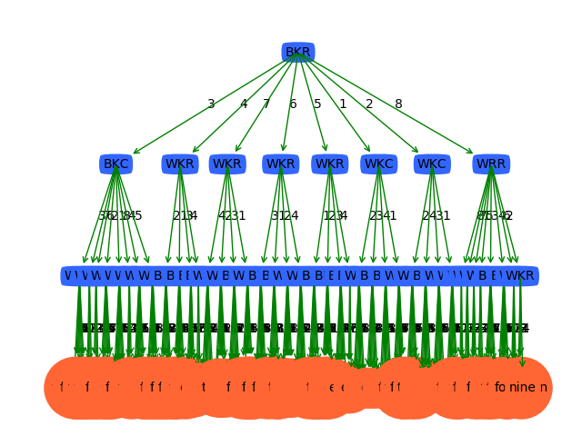

# 人工智能基础编程作业2 —— 国际象棋 Checkmate 预测

>   姓名：张劲暾
>
>   学号：PB16111485

---

## 目录

[TOC]

---

## K近邻

### 算法伪代码

```ps
搜索k近邻的算法：kNN(A[n],k)

#输入：A[n]为N个训练样本在空间中的坐标，k为近邻数
#输出：x所属的类别

取A[1]~A[k]作为x的初始近邻，计算与测试样本x间的欧式距离d（x,A[i]）,i=1,2,.....,k；
按d（x，A[i]）升序排序；
取最远样本距离D = max{d(x,a[j]) | j=1,2,...,k};

for(i=k+1;i<=n;i++)#继续计算剩下的n-k个数据的欧氏距离
      计算a[i]与x间的距离d(x,A[i]);
      if(d(x,A[i]))<D
               then 用A[i]代替最远样本#将后面计算的数据直接进行插入即可
 
 最后的K个数据是有大小顺序的，再进行K个样本的统计即可
 计算前k个样本A[i]),i=1,2,..,k所属类别的概率;
 具有最大概率的类别即为样本x的类
```

### 原始六个特征K近邻结果

| K    | Accuracy               | Macro_F1               | Micro_F1               |
| :--- | ---------------------- | ---------------------- | ---------------------- |
| 1    | 0.5166739445197767     | 0.4825912152571868     | 0.532271696098928      |
| 2    | 0.5166739445197767     | 0.4825912152571868     | 0.532271696098928      |
| 3    | 0.5770129103462437     | 0.581237828743619      | 0.6334682620879855     |
| 4    | 0.6257410860912406     | 0.6540083894372599     | 0.7009474667496998     |
| 5    | 0.6631759048939496     | 0.6981780269374958     | 0.7460522218762512     |
| 6    | 0.6908515411327248     | 0.7245641871519749     | 0.7762555046483697     |
| 7    | 0.7076840746686813     | **0.7319563508661349** | 0.7934700413682665     |
| 8    | **0.7102328373297949** | 0.7289661911479546     | **0.7960055157688715** |
| 9    | 0.6992317501788435     | 0.7121129711445539     | 0.7849294960188604     |

### 增加人工处理特征

根据国际象棋规则，加入白皇白车行差，白皇白车列差，白皇黑皇行差，白皇黑皇列差，黑皇白车行差，黑皇白车列差，黑皇白车曼哈顿距离7个特征

| K    | Accuracy               | Macro_F1               | Micro_F1               |
| :--- | ---------------------- | ---------------------- | ---------------------- |
| 1    | 0.4401566324033284     | 0.3075965795721245     | 0.3640407455184378     |
| 2    | 0.4401566324033284     | 0.3075965795721245     | 0.3640407455184378     |
| 3    | 0.45809475292919       | 0.3515211305446855     | 0.40852275254659487    |
| 4    | 0.48191815473000493    | 0.42720581109097844    | 0.4624794270717495     |
| 5    | 0.5077353930934797     | 0.4916491201196514     | 0.5152350874071439     |
| 6    | 0.5344602144402444     | 0.5411208617776218     | 0.5644766691873138     |
| 7    | 0.5622077175081902     | 0.5822835530138714     | 0.6106489924825408     |
| 8    | 0.582575345305657      | 0.6040453374626259     | 0.6417419153952226     |
| 9    | **0.5997652269028626** | **0.6217707015240818** | **0.6663404652817935** |

效果不好，改变策略，使用原始特征，但在计算距离时使用曼哈顿距离

| K    | Accuracy              | Macro_F1               | Micro_F1               |
| ---- | --------------------- | ---------------------- | ---------------------- |
| 1    | 0.5145688846162649    | 0.49113765588639235    | 0.528312797473422      |
| 2    | 0.5145688846162649    | 0.49113765588639235    | 0.528312797473422      |
| 3    | 0.575270605696154     | 0.5837432187313495     | 0.6308438236733241     |
| 4    | 0.6248019788221562    | 0.6597124772836322     | 0.6997464525599395     |
| 5    | 0.6599442242771173    | 0.7007561053735905     | 0.742360215292914      |
| 6    | 0.6869251688208513    | 0.726098842863655      | 0.7721186779947511     |
| 7    | 0.7042699163560039    | **0.7425308815600872** | 0.7900449268270985     |
| 8    | **0.711356516786381** | 0.7420203626350129     | **0.7971175659445754** |
| 9    | 0.7081299020379879    | 0.7307470765596854     | 0.7939148614385481     |
| 10   | 0.701063398509371     | 0.7175515951088984     | 0.7867977403140429     |
| 11   | 0.6955970172344441    | 0.7125534768791278     | 0.7811930074284952     |

效果稍微好了一点，

## 决策树

### 算法伪代码

```pseudocode
算法：Generate_decision_tree(samples, attribute)。由给定的训练数据产生一棵判定树。

输入：训练样本samples，由离散值属性表示；候选属性的集合attribute_list。

输出：一棵判定树。

方法：

Generate_decision_tree(samples, attribute_list)

(1) 创建结点 N；

(2) if samples 都在同一个类C then   //类标号属性的值均为C，其候选属性值不考虑

(3) return N 作为叶结点，以类C 标记；

(4) if attribut_list 为空 then      

(5) return N 作为叶结点，标记为 samples 中最普通的类； //类标号属性值数量最大的那个

(6) 选择attribute_list 中具有最高信息增益的属性best_attribute；//找出最好的划分属性

(7) 标记结点 N 为best_attribute；

(8) for each best_attribute 中的未知值a i //将样本samples按照best_attribute进行划分

(9) 由结点 N 长出一个条件为 best_attribute = a i 的分枝；

(10) 设si 是samples 中best_attribute = a i 的样本的集合；//a partition

(11) if si 为空 then

(12) 加上一个树叶，标记为 samples 中最普通的类；//从样本中找出类标号数量最多的，作为此节点的标记

(13) else 加上一个由 Generate_decision_tree(si,attribute_list–best_attribute)返回的结点；//对数据子集si,递归调用，此时候选属性已删除best_attribute
```

### 不同划分阈值下的测试结果

|   threshold   |   Accuracy   |  Macro_F1    |   Micro_F1   |
| ---- | ---- | ---- | ---- |
|0.0     |0.6005326231691078     |0.38828709588714916     |0.4786460699681963 |
| 0.1	| 0.6005326231691078	| 0.38828709588714916	| 0.4786460699681963 |
| 0.2	| **0.6005326231691078**	| **0.38828709588714916**	| **0.4786460699681963** |
| 0.3	| 0.5873427091043671	| 0.3818813027060383	| 0.4668404942750255 |
| 0.4	| 0.5754970445996775	| 0.37612291092052796	| 0.45778781038374716|
| 0.5	| 0.5537000654878848	| 0.3720458715108832	| 0.447225606379444  |
| 0.6	| 0.5323182993392703	| 0.38259774508016153	| 0.4443494066075056 |
| 0.7	| 0.5066490954834072	| 0.3709375325080947	| 0.43944916970433373|
| 0.8	| 0.4812407680945347	| 0.33699866221808056	| 0.427757736852098  |
| 0.9	| 0.4686658286945592	| 0.33453380364743074	| 0.41612220484034235|
| 1.0	| 0.4574530763403754	| 0.3230775151244868	| 0.3992059195091139 |
| 1.1	| 0.4478330658105939	| 0.30676828144247165	| 0.38122383539681126|
| 1.2	| 0.44632499006754073	| 0.3038593126354794	| 0.3787286931818182 |
| 1.3	| 0.4444444444444444	| 0.28410325701391037	| 0.3745012855749623 |
| 1.4	| 0.44387634704633055	| 0.2783255571396552	| 0.37342781222320637|
| 1.5	| 0.4439461883408072	| 0.27855346828947536	| 0.3736049601417184 |
| 1.6	| 0.44370236505067967	| 0.2782752572305032	| 0.3731184699840623 |
| 1.7	| 0.44370236505067967	| 0.2782752572305032	| 0.3731184699840623 |
| 1.8	| 0.44370236505067967	| 0.27829636214851877	| 0.3731184699840623 |
| 1.9	| 0.44370236505067967	| 0.27829636214851877	| 0.3731184699840623 |

### 不同阈值下决策树结构的变化

threshold = 0.2


threshold = 1.2


threshold = 1.9



## 多分类SVM

使用SMO方法学习SVM，对于800例采样下不同的参数组合结果为：

|   sigma   | C | Accuracy    |   Macro_F1   |   Micro_F1   |
| ---- | ---- | ---- | ---- | ---- |
|0|1|0.34263697591165587  |0.05356627244474779|0.040729590933238885|
|1|1|0.4109599010261262	|0.25155148020852286|0.2833362847529662|
|2|1|0.39125614910275064	|0.14372953461996|0.22206481317513724|
|3|1|0.38240671768131645	|0.1222569467495856|0.19249158845404638|
|1.6|10|**0.4434932851645331**|**0.31236341413397417**|**0.3725872144501505**|

SMO方法伪代码：

```pseudocode
创建一个alpha向量并将其初始化为O向量
 
当迭代次数小于最大迭代次数时（外循环）
 
对数据集中的每个数据向量（内循环）： 
 
如果该数据向量可以被优化：
 
随机选择另外一个数据向量
 
同时优化这两个向量
 
如果两个向量都不能被优化，退出内循环
 
如果所有向量都没被优化，增加迭代数目，继续下一次循环
```

SMO实现：

```python
def trainSVM(self):
        '''
        '''
        entireSet = True
        alphaPairsChanged = 0
        iterCount = 0
        while alphaPairsChanged > 0 or entireSet :
            alphaPairsChanged = 0
            if entireSet:
                # update alphas over all training examples
                for i in range(self.trainX.shape[0]):
                    alphaPairsChanged += self.innerLoop(i)
                print("iter: %d entire set, alpha pairs changed: %d"%(iterCount,alphaPairsChanged))
                iterCount += 1
            else:
                # update alphas over examples where alpha is not 0 & not C (not on boundary)
                nonBoundAlphasList = np.nonzero((self.alphas > 0) * (self.alphas < self.C))[0]
                for i in nonBoundAlphasList:
                    alphaPairsChanged += self.innerLoop(i)
                print("iter: %d non boundary, alpha pairs changed: %d"%(iterCount,alphaPairsChanged))
                iterCount += 1
            # alternate loop over all examples and non-boundary examples
            if entireSet :
                entireSet = False
            elif alphaPairsChanged == 0 :
                entireSet = True
```

## 交叉验证

KNN交叉验证结果：

|   K   |   Micro F1 1-fold   |    Micro F1 2-fold  |   Micro F1 3-fold   |    Micro F1 4-fold  |   Micro F1 5-fold   |  Micro F1 mean    |
| ---- | ---- | ---- | ---- | ---- | ---- | ---- |
|1	|0.5348066298342542	|0.5334806629834254	|0.5383425414364641	|0.5239779005524862	|0.5312707182320442	| 0.5323756906077348 |
|2	|0.5348066298342542	|0.5334806629834254	|0.5383425414364641	|0.5239779005524862	|0.5312707182320442	| 0.5323756906077348 |
|3	|0.6296132596685083	|0.6218784530386741	|0.6209944751381216	|0.6161325966850829	|0.6165745856353592	| 0.6210386740331492 |
|4	|0.6775690607734807	|0.6738121546961326	|0.6735911602209945	|0.6702762430939226	|0.6689502762430939	| 0.6728397790055248 |
|5	|0.7080662983425414	|0.6941436464088397	|0.6965745856353591	|0.7007734806629834	|0.6983425414364641	| 0.6995801104972376 |
|6	|0.7116022099447514	|0.7085082872928177	|0.7049723756906078	|0.7149171270718232	|0.7102762430939227	| 0.7100552486187846 |
|7	|0.7160220994475138	|0.7069613259668508	|0.7043093922651934	|0.7129281767955801	|0.7173480662983427	| **0.7115138121546962** |
|8	|0.7104972375690609	|0.6990055248618785	|0.7040883977900553	|0.7076243093922651	|0.7155801104972375	| 0.7073591160220994 |
|9	|0.7071823204419889	|0.6943646408839779	|0.703646408839779	|0.7009944751381215	|0.7093922651933702	| 0.7031160220994475 |
|10	|0.7043093922651934	|0.6983425414364641	|0.6956906077348066	|0.6970165745856354	|0.7003314917127071	| 0.6991381215469614 |
|11	|0.7023204419889503	|0.6892817679558011	|0.6932596685082872	|0.6928176795580111	|0.698121546961326	| 0.695160220994475 |

SVM交叉验证结果因为计算量太大，无法在实验截止时间前完成计算。

