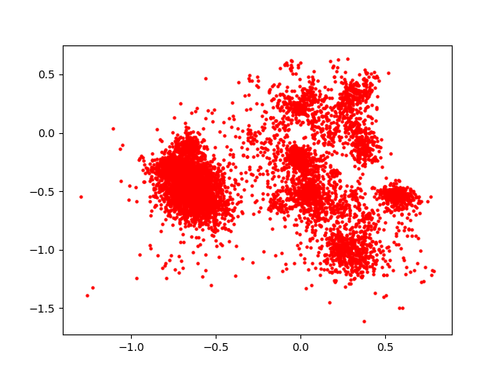

# 人工智能基础编程作业2 —— 对青蛙进行聚类

>   姓名：张劲暾
>
>   学号：PB16111485

---

## 目录

[TOC]

---

## Kmeans 聚类

### 算法伪代码

```pseudocode

创建 k 个点作为起始质心 (随机选择):
    当任意一个点的簇分配结果发生改变的时候:
        对数据集中的每个数据点:
            对每个质心:
                计算质心与数据点之间的距离
            将数据点分配到距其最近的簇
        对每一个簇:
            求出均值并将其更新为质心
```

### 实验结果图表

选用 Species 聚类(原来是10个类)，不同K值下聚类结果:

对于K值得选择，隐含认为是10，但是，实际上K=7时的兰德系数和K=19时的纯度都很大程度上好于K=10的情况，这说明也许还有一些“亚结构”存在于原来给出的10个分类中，或者说这十个分类还可以进一步分裂或者组合

|  k   |    purity  |   RI   |
| ---- | ---- | ---- |
|1	 |0.4833912439193885|.2806709547061144|
|2	|0.6361362056984017	|0.7755380468928456|
|3	|0.636275191104934	|0.8702382793239649|
|4	|0.7270326615705351	|0.8895555316240092|
|5	|0.6347463516330786	|0.6204129865877633|
|6	|0.758443363446838	|0.7797900151686297|
|7	|0.804864489228631	|**0.9373379223951465**|
|8	|0.809728978457262	|0.7894756077713995|
|9	|0.828353022932592	|0.7786795227362836|
|10	|0.8073662265462126	|0.763572514114649|
|11	|0.8693537178596248	|0.7891690865162424|
|12	|0.8375260597637249	|0.7771071621913334|
|13	|0.7945795691452398	|0.7606786042156332|
|14	|0.8015288394718555	|0.7536366125615185|
|15	|0.8706045865184155	|0.7716779034935175|
|16	|0.8068102849200834	|0.7592539410186114|
|17	|0.8854760250173732	|0.7720108503270117|
|18	|0.8875608061153579	|0.7678242505871143|
|19	|**0.9121612230715774**	|0.8102163256179852|
|20	|0.9081306462821404	|0.7709735691095034|

## Kmeans_PCA 聚类

### PCA计算

```python
def PCA(data, threshold):
    '''
    '''
    covMatrix = np.cov(data, rowvar = 0)
    eigenValues, eigenVectors = np.linalg.eig(np.mat(covMatrix))
    eigenValuesSortedIndex = np.argsort(eigenValues)
    m = 1
    while float(np.sum(eigenValues[eigenValuesSortedIndex[-1:-(m+1):-1]]) / np.sum(eigenValues)) < threshold:
        print(float(np.sum(eigenValues[eigenValuesSortedIndex[-1:-(m+1):-1]]) / np.sum(eigenValues)))
        m += 1
    newData = data * eigenVectors[:, eigenValuesSortedIndex[-1:-(m+1):-1]]
    return newData
```

### PCA降维后的散点图



### 使用PCA之后的Kmeans聚类结果

选用 Species 聚类(原来是10个类)，不同参数组合下聚类结果:

然而并没有看到使用PCA之后结果有所提升，可能是因为KMeans聚类完全依赖于欧氏距离，降维反而会导致区分度降低而导致的，之后的DBSCAN不完全依赖于欧氏距离，使用PCA的结果就相对好一点

|   k   |   threshold   |   purity   |   RI   |
| ---- | ---- | ---- | ---- |
|1	| 0.1	| 0.4833912439193885| 0.2806709547061144|
|2	| 0.1	| 0.6364141765114663| 0.7755969249358073|
|3	| 0.1	| 0.7157748436414176| 0.8856724396961252|
|4	| 0.1	| 0.7149409312022238| 0.7827521525111302|
|5	| 0.1	| 0.7148019457956915| 0.7673751702909276|
|6	| 0.1	| 0.7248088950660181| 0.7768600598535486|
|7	| 0.1	| 0.7317581653926337| 0.8153868531781925|
|8	| 0.1	| 0.7303683113273106| 0.7910766346601015|
|9	| 0.1	| 0.7302293259207783| 0.7724051864060876|
|10	| 0.1	| 0.7273106323835997| 0.7878310791265458|
|11	| 0.1	| 0.7396803335649756| 0.7643042399241616|
|12	| 0.1	| 0.7378735232800556| 0.7565568707710986|
|13	| 0.1	| 0.7364836692147324| 0.7748396234934595|
|14	| 0.1	| 0.7405142460041696| 0.751409948515517|
|15	| 0.1	| 0.7396803335649756| 0.7550758407337348|
|16	| 0.1	| 0.7391243919388464| 0.7513963107535975|
|17	| 0.1	| 0.7416261292564281| 0.7386151393645015|
|18	| 0.1	| 0.7388464211257818| 0.7514754329530632|
|19	| 0.1	| 0.7410701876302989| 0.7308225299303962|
|20	| 0.1	| 0.742460041695622| 0.7575118231765651|
|1	| 0.2	| 0.4833912439193885| 0.2806709547061144|
|2	| 0.2	| 0.6364141765114663| 0.7756032608931864|
|3	| 0.2	| 0.7157748436414176| 0.8856724396961252|
|4	| 0.2	| 0.7149409312022238| 0.7827521525111302|
|5	| 0.2	| 0.7148019457956915| 0.7673751702909276|
|6	| 0.2	| 0.7248088950660181| 0.7767766879265724|
|7	| 0.2	| 0.7216122307157748| 0.7822550502940763|
|8	| 0.2	| 0.7303683113273106| 0.7908317344538448|
|9	| 0.2	| 0.7402362751911049| 0.7918265570301358|
|10	| 0.2	| 0.7388464211257818| 0.7726758940484981|
|11	| 0.2	| 0.7360667129951355| 0.7613189608836729|
|12	| 0.2	| 0.7406532314107018| 0.7623737818856331|
|13	| 0.2	| 0.7394023627519111| 0.7581009513111616|
|14	| 0.2	| 0.7388464211257818| 0.7598913615112803|
|15	| 0.2	| 0.7385684503127171| 0.7548453509671269|
|16	| 0.2	| 0.7396803335649756| 0.7493909416092269|
|17	| 0.2	| 0.7407922168172342| 0.7407624880416048|
|18	| 0.2	| 0.7396803335649756| 0.7437449081744958|
|19	| 0.2	| 0.7430159833217512| 0.7458839119321241|
|20	| 0.2	| 0.744683808200139| 0.7526909322888018|
|1	| 0.3	| 0.4833912439193885| 0.2806709547061144|
|2	| 0.3	| 0.6364141765114663| 0.7756032608931864|
|3	| 0.3	| 0.7157748436414176| 0.8856724396961252|
|4	| 0.3	| 0.7149409312022238| 0.7827521525111302|
|5	| 0.3	| 0.7148019457956915| 0.7673751702909276|
|6	| 0.3	| 0.7248088950660181| 0.7772587615617942|
|7	| 0.3	| 0.7270326615705351| 0.7795385472016751|
|8	| 0.3	| 0.7263377345378735| 0.761501969603824|
|9	| 0.3	| 0.7402362751911049| 0.7916671536146106|
|10	| 0.3	| 0.7257817929117443| 0.7608889657273964|
|11	| 0.3	| 0.7396803335649756| 0.7644406175433581|
|12	| 0.3	| 0.7364836692147324| 0.7561944849161234|
|13	| 0.3	| 0.732314107018763| 0.763860645639852|
|14	| 0.3	| 0.739819318971508| 0.7660906708339752|
|15	| 0.3	| 0.742043085476025| 0.7718893467541016|
|16	| 0.3	| 0.7432939541348158| 0.7438237599367563|
|17	| 0.3	| 0.7432939541348158| 0.7574631058457416|
|18	| 0.3	| 0.7370396108408617| 0.7563886588294608|
|19	| 0.3	| 0.739819318971508| 0.7634038772002602|
|20	| 0.3	| 0.7428769979152189| 0.7422252056167876|
|1	| 0.4	| 0.4833912439193885| 0.2806709547061144|
|2	| 0.4	| 0.6361362056984017| 0.7754866638238566|
|3	| 0.4	| 0.6350243224461432| 0.6701707279734933|
|4	| 0.4	| 0.6348853370396108| 0.7592945452332787|
|5	| 0.4	| 0.746907574704656| 0.8085909593808147|
|6	| 0.4	| 0.7883252258512856| 0.9347881631566975|
|7	| 0.4	| 0.7280055594162613| 0.79064571229055|
|8	| 0.4	| 0.7820708825573315| 0.8212436730974381|
|9	| 0.4	| 0.7824878387769284| 0.7977414050468412|
|10	| 0.4	| 0.8454482279360667| 0.8344698295907561|
|11	| 0.4	| 0.7507991660875608| 0.7537818373407137|
|12	| 0.4	| 0.8569840166782488| 0.8375818664127133|
|13	| 0.4	| 0.800416956219597| 0.7549221551334052|
|14	| 0.4	| 0.830993745656706| 0.7597550225259704|
|15	| 0.4	| 0.8006949270326615| 0.7465749176253103|
|16	| 0.4	| 0.8307157748436415| 0.7508861116490343|
|17	| 0.4	| 0.8416956219596943| 0.7629578876149902|
|18	| 0.4	| 0.8405837387074357| 0.7529855156730434|
|19	| 0.4	| 0.830993745656706| 0.7473786956330669|
|20	| 0.4	| 0.8497567755385684| 0.7732982859593349|
|1	| 0.5	| 0.4833912439193885| 0.2806709547061144|
|2	| 0.5	| 0.6361362056984017| 0.7754866638238566|
|3	| 0.5	| 0.6355802640722724| 0.8692880402526463|
|4	| 0.5	| 0.7471855455177207| 0.9210585298550601|
|5	| 0.5	| 0.7467685892981237| 0.8085394217762799|
|6	| 0.5	| 0.746907574704656| 0.791456598933415|
|7	| 0.5	| 0.7959694232105629| 0.8061193178607837|
|8	| 0.5	| 0.7271716469770674| 0.7673388930715437|
|9	| 0.5	| 0.8056984016678249| 0.7835615710663097|
|10	| 0.5	| 0.7256428075052119| 0.7468153749346242|
|11	| 0.5	| 0.7815149409312022| 0.7597160795684208|
|12	| 0.5	| 0.7763724808895066| 0.748955421807187|
|13	| 0.5	| 0.776511466296039| 0.7429356827887484|
|14	| 0.5	| 0.843363446838082| 0.7689217233997241|
|15	| 0.5	| 0.8280750521195275| 0.7671007151615307|
|16	| 0.5	| 0.8404447533009034| 0.7917637383307553|
|17	| 0.5	| 0.8428075052119527| 0.7528339935703554|
|18	| 0.5	| 0.8418346073662265| 0.7631270654037893|
|19	| 0.5	| 0.8387769284225156| 0.7496517203428178|
|20	| 0.5	| 0.8572619874913134| 0.7572882488756332|
|1	| 0.6	| 0.4833912439193885| 0.2806709547061144|
|2	| 0.6	| 0.6361362056984017| 0.7754753827290108|
|3	| 0.6	| 0.6350243224461432| 0.6701707279734933|
|4	| 0.6	| 0.6348853370396108| 0.7592945452332787|
|5	| 0.6	| 0.7467685892981237| 0.8085394217762799|
|6	| 0.6	| 0.7277275886031966| 0.8092144716743588|
|7	| 0.6	| 0.7959694232105629| 0.8068301427377228|
|8	| 0.6	| 0.7959694232105629| 0.782486699077278|
|9	| 0.6	| 0.8006949270326615| 0.7956391421152342|
|10	| 0.6	| 0.7959694232105629| 0.7619298012624588|
|11	| 0.6	| 0.7772063933287005| 0.7570394466468443|
|12	| 0.6	| 0.7630298818624045| 0.7556584783754065|
|13	| 0.6	| 0.8087560806115358| 0.7667165397945933|
|14	| 0.6	| 0.8133425990271022| 0.7578438814306707|
|15	| 0.6	| 0.8485059068797777| 0.7758608716480878|
|16	| 0.6	| 0.8116747741487144| 0.7527384906030316|
|17	| 0.6	| 0.8304378040305768| 0.7618681029457856|
|18	| 0.6	| 0.8404447533009034| 0.7565726720306598|
|19	| 0.6	| 0.8415566365531619| 0.7585789683883053|
|20	| 0.6	| 0.8551772063933287| 0.7743084075546633|
|1	| 0.7	| 0.4833912439193885| 0.2806709547061144|
|2	| 0.7	| 0.6359972202918693| 0.7754131821718135|
|3	| 0.7	| 0.6347463516330786| 0.6701818931666796|
|4	| 0.7	| 0.6348853370396108| 0.7594316955302042|
|5	| 0.7	| 0.7455177206393329| 0.8081139854186054|
|6	| 0.7	| 0.6339124391938846| 0.7172135116222803|
|7	| 0.7	| 0.7968033356497568| 0.7915157087796956|
|8	| 0.7	| 0.7966643502432245| 0.772651168361165|
|9	| 0.7	| 0.7963863794301599| 0.7667450516027993|
|10	| 0.7	| 0.7961084086170952| 0.7561480856184875|
|11	| 0.7	| 0.8271021542738013| 0.780440802986013|
|12	| 0.7	| 0.7731758165392634| 0.746356713434596|
|13	| 0.7	| 0.8382209867963863| 0.773439106475474|
|14	| 0.7	| 0.8279360667129951| 0.7583052859366375|
|15	| 0.7	| 0.8107018763029882| 0.7501878427851941|
|16	| 0.7	| 0.799583043780403| 0.7457253584621009|
|17	| 0.7	| 0.8768589298123697| 0.7729317276446224|
|18	| 0.7	| 0.8831132731063238| 0.7656987686897462|
|19	| 0.7	| 0.8490618485059068| 0.7602772367692219|
|20	| 0.7	| 0.881445448227936| 0.764360799933936|
|1	| 0.8	| 0.4833912439193885| 0.2806709547061144|
|2	| 0.8	| 0.6361362056984017| 0.7755011128973918|
|3	| 0.8	| 0.635858234885337| 0.6887154957138117|
|4	| 0.8	| 0.6355802640722724| 0.6450495069108779|
|5	| 0.8	| 0.7553856845031272| 0.814807267613551|
|6	| 0.8	| 0.8152883947185545| **0.9372957341911344** |
|7	| 0.8	| 0.8113968033356498| 0.8278934921701185|
|8	| 0.8	| 0.8155663655316192| 0.7941136444745575|
|9	| 0.8	| 0.8347463516330785| 0.8340620102853065|
|10	| 0.8	| 0.8186240444753301| 0.7775580969140701|
|11	| 0.8	| 0.8533703961084086| 0.7884400650787817|
|12	| 0.8	| 0.8112578179291174| 0.7597578427996818|
|13	| 0.8	| 0.8633773453787352| 0.7842394026042137|
|14	| 0.8	| 0.8321056289089646| 0.7609933158547192|
|15	| 0.8	| 0.8279360667129951| 0.7575333036174356|
|16	| 0.8	| 0.8903405142460041| 0.7781766640701475|
|17	| 0.8	| 0.8683808200138985| 0.7659319241945197|
|18	| 0.8	| 0.857539958304378| 0.7579015618231524|
|19	| 0.8	| 0.8658790826963169| 0.7582853894851117|
|20	| 0.8	| 0.8903405142460041| 0.7641657760750965|
|1	| 0.9	| 0.4833912439193885| 0.2806709547061144|
|2	| 0.9	| 0.6361362056984017| 0.7755380468928456|
|3	| 0.9	| 0.635858234885337| 0.68602255929215|
|4	| 0.9	| 0.7549687282835302| 0.9051250265004315|
|5	| 0.9	| 0.7248088950660181| 0.7810915908033965|
|6	| 0.9	| 0.8100069492703266| 0.8404554162535658|
|7	| 0.9	| 0.790271021542738| 0.8389104085002277|
|8	| 0.9	| 0.8098679638637943| 0.7688517187974623|
|9	| 0.9	| 0.7842946490618485| 0.7653634265552917|
|10	| 0.9	| 0.857539958304378| 0.840744320456498|
|11	| 0.9	| 0.7780403057678944| 0.7690258803576145|
|12	| 0.9	| 0.838915913829048| 0.7741974896666427|
|13	| 0.9	| 0.8758860319666435| 0.8412328073168718|
|14	| 0.9	| 0.8665740097289785| 0.7799559477109663|
|15	| 0.9	| 0.8682418346073663| 0.7667543623694356|
|16	| 0.9	| 0.88408617095205| 0.7746177104496453|
|17	| 0.9	| 0.874774148714385| 0.771735236181021|
|18	| 0.9	| 0.8539263377345379| 0.7576208093702628|
|19	| 0.9	| 0.8485059068797777| 0.761506103429675|
|20	| 0.9	| **0.8979847116052815** | 0.7678565098823067|

## DBSCAN 聚类

### 算法伪代码

```pseudocode
 ε-邻域：对于样本集中的xj, 它的ε-邻域为样本集中与它距离小于ε的样本所构成的集合。 
 核心对象：若xj的ε-邻域中至少包含MinPts个样本，则xj为一个核心对象。 
 密度直达：若xj位于xi的ε-邻域中，且xi为核心对象，则xj由xi密度直达。 
 密度可达：若样本序列p1, p2, ……, pn。pi+1由pi密度直达，则p1由pn密度可达。
 
输入：样本集D={x1,x2,...,xm}
    邻域参数(ε,MinPts).
过程：
初始化核心对象集合：Ω = Ø
for j=1,2,...,m do
    确定样本xj的ε-邻域N(xj);
    if |N(xj)|>=MinPts then
        将样本xj加入核心对象集合Ω
    end if
end for
初始化聚类簇数：k=0
初始化未访问样本集合：Γ =D
while Ω != Ø do
    记录当前未访问样本集合：Γold = Γ;
    随机选取一个核心对象 o ∈ Ω，初始化队列Q=<o>
    Γ = Γ\{o};
    while Q != Ø do
        取出队列Q中首个样本q;
        if |N(q)|<=MinPts then
            令Δ = N(q)∩Γ；
            将Δ中的样本加入队列Q;
            Γ = Γ\Δ；
        end if
    end while
    k = k+1,生成聚类簇Ck = Γold\Γ;
    Ω = Ω\Ck
end while
输出：
簇划分C = {C1,C2,...,Ck}
```

### 实验结果图表

选用 Species 聚类(原来是10个类)，不同参数组合下聚类结果(因为时间不足，所以测试有限):

|   eps   |   minPts   |   purity   |   RI   |
| ---- | ---- | ---- | ---- |
|0.1	|5	|**0.840722724113968**	|**0.9352719366829235**|
|0.1	|6	|0.8373870743571925	|0.9318708411224883|
|0.1	|7	|0.828769979152189	|0.9284221099800505|
|0.1	|8	|0.8200138985406532	|0.9247950448177229|

